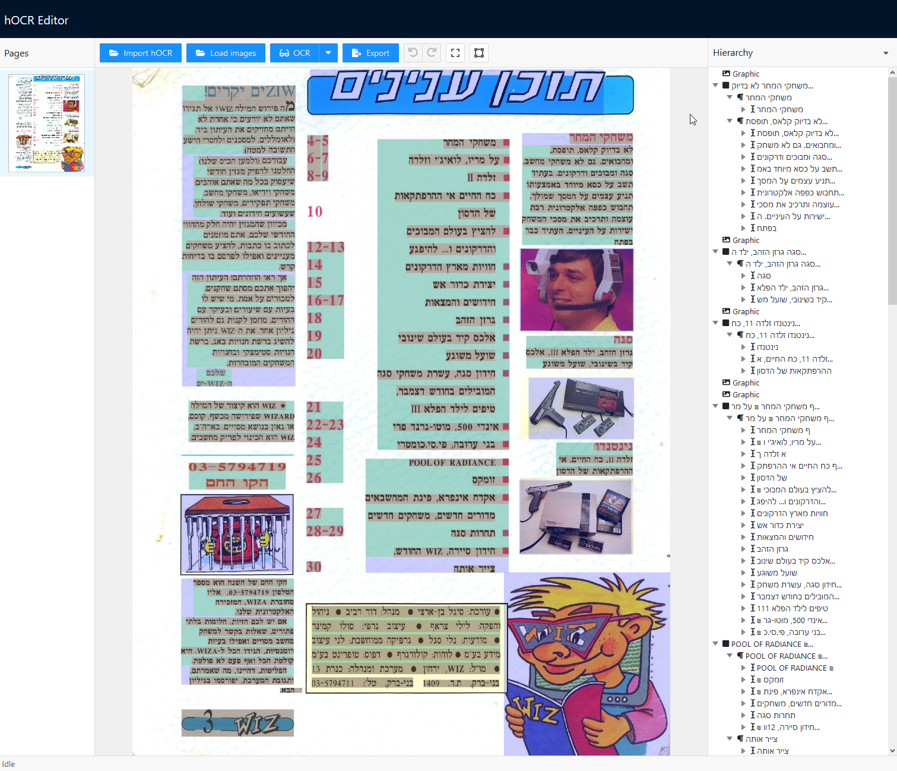

# hOCR Editor

This is a visual [hOCR](https://en.wikipedia.org/wiki/HOCR) file editor with built-in [Tesseract](https://tesseract.projectnaptha.com) functionality, built using [React](https://reactjs.org).

This project is still early work-in-progress.

## Rationale

While working on a personal project, I went looking for an editor which would allow me to correct some of the mistakes made by Tesseract in magazine scans with mixed language (Hebrew and English in my case).

After going through the [list of applications mentioned](https://tesseract-ocr.github.io/tessdoc/User-Projects-%E2%80%93-3rdParty.html) in the Tesseract docs, I couldn't find a free and open-source and convenient enough application which allowed for both
correcting recognition errors and restructuring the document features.

Tesseract, on occasion, leaves text lines in separate paragraphs to where one would expect them, and occasionally fails to correctly recognize letters or words, especially in mixed-language sentences.

This application was designed to help reorganize the structure of documents and help edit recognized words using easy-to-use visual representation of the document.

## Features

- Drag & drop interface for restructuring or resizing of sentences, paragraphs and blocks.
- Optional automatic resizing of elements to wrap their contents.
- Optional automatic cleanup of empty elements.
- Import and export of hOCR documents.
- Built-in OCR, using Tesseract, of one or more documents or regions of documents.

## Available Scripts

This project was bootstrapped with [Create React App](https://github.com/facebook/create-react-app).

In the project directory, you can run:

### `yarn start`

Runs the app in the development mode. 
Open [http://localhost:3000](http://localhost:3000) to view it in the browser.

The page will reload if you make edits. 
You will also see any lint errors in the console.

### `yarn build`

Builds the app for production to the `build` folder. 
It correctly bundles React in production mode and optimizes the build for the best performance.

The build is minified and the filenames include the hashes. 
Your app is ready to be deployed!

See the section about [deployment](https://facebook.github.io/create-react-app/docs/deployment) for more information.
